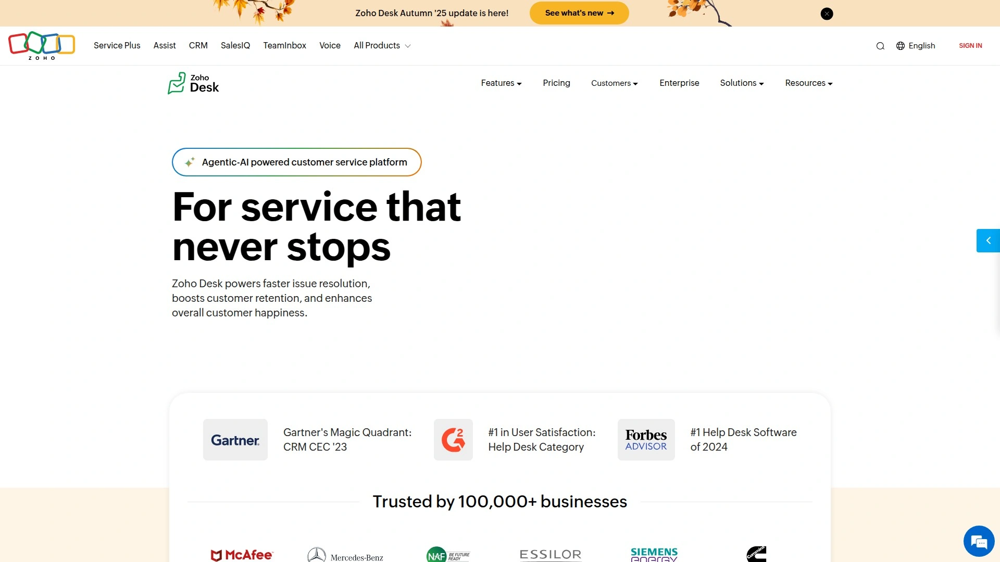

# Top 18 AI Writing Assistants Ranked in 2025 (Latest Compilation)

Struggling to polish emails in minutes, catch subtle grammar mistakes, or maintain consistent tone across documents? Whether you're drafting blog posts, academic papers, or business communications, the right writing assistant can cut editing time in half while improving clarity and professionalism. This guide ranks 18 leading tools by accuracy, ease of use, and practical value—helping you find the solution that fits your workflow and budget.

***

## **[Grammarly](https://grammarly.com)**

The gold standard for real-time grammar correction and tone refinement across all writing contexts.

Grammarly leads the market with its sophisticated AI-powered engine that catches everything from basic punctuation to complex sentence structure issues. The platform stands out for its customizable writing goals—you can select formal or informal tone, storytelling or educational style, making it invaluable for creative work where context matters. Its 2025 update introduced eight specialized AI agents for targeted assistance, from finding credible sources to predicting reader reactions.

The free version delivers robust grammar and spelling checks with a generous 150,000-word monthly limit, while premium tiers unlock full-sentence rewrites, plagiarism detection, and tone adjustments. Integration spans browser extensions, desktop apps, Gmail, Google Docs, and Microsoft Office. Real-time scoring helps writers track improvements as they edit, and the tone detector ensures messages land exactly as intended—whether you're emailing a CEO or posting on social media.

Best for professionals and students who need consistent, accurate English checks with minimal setup.

***

## **[ProWritingAid](https://prowritingaid.com)**

Deep-dive reports and style analysis for writers who want to understand *why* changes improve their work.

ProWritingAid goes beyond surface corrections by providing detailed reports on writing style, overused words, readability, pacing, and dialogue tags. The Word Explorer feature taps into contextual thesauruses and collocation dictionaries to help you choose precise vocabulary, while repetition elimination catches blind spots that ruin reader experience. Writers appreciate the real-time scoring system that updates as you edit, showing immediate impact of each change.

**Core strengths:** Grammar and spell check, Rephrase feature with multiple style options (Fluency, Formal, Sensory, Shorten, Expand), consistency checks, plagiarism detection, and integration with Word, Google Docs, Scrivener.

Ideal for novelists, essayists, and content creators who want mentoring-level feedback rather than quick fixes.

***

## **[QuillBot](https://quillbot.com)**

All-in-one paraphrasing and grammar suite with the highest correction score in independent testing.

QuillBot earned top marks in Scribbr's 2024 testing, fixing 20 out of 20 errors with zero new mistakes introduced—outperforming every competitor. The platform combines grammar checking, paraphrasing with multiple modes, summarization tools, AI chat, translation, and plagiarism detection. The paraphraser offers Standard and Fluency modes for free users, with premium styles unlocked for paid plans.

Free users can check unlimited text without sign-up, though paraphrasing is capped at 600 words (1,200 with an account). The dual-pane interface keeps original and revised text side by side, and the summarizer condenses research notes into bullet points or paragraphs. Integration with Google Docs and Word makes it seamless for academic and professional writing.

Perfect for students and content creators who need reliable rewording alongside grammar correction.

***

## **[Hemingway Editor](https://hemingwayapp.com)**

Readability-focused tool that simplifies complex prose into clear, engaging sentences.

Hemingway Editor strips away fluff by highlighting complex sentences, unnecessary adverbs, and passive voice constructions. It assigns a readability grade level and suggests concrete ways to boost conciseness and impact. The color-coded system makes it easy to spot problem areas at a glance—dense sentences glow red, weaker phrases turn yellow.

**Key features:** Sentence complexity scoring, adverb flagging, passive voice detection, readability grading, formatting preservation.

Unlike grammar checkers that focus on correctness, Hemingway prioritizes flow and clarity. The desktop app works offline, and the web version requires no sign-up. Writers using Hemingway report sharper, more direct prose that holds reader attention.

Best for bloggers, journalists, and anyone aiming for bold, clear communication.

***

## **[LanguageTool](https://languagetool.org)**

Multilingual powerhouse supporting 30+ languages with no sign-up required for unlimited checks.

LanguageTool scored 19 out of 20 in accuracy testing, nearly matching QuillBot's performance. The platform supports over 30 languages including English, Spanish, German, French, and Portuguese—making it the go-to choice for multilingual writers. The "Fix All" button lets you apply corrections in one click, and the interface integrates with Chrome, Edge, and popular writing apps.

Free access includes unlimited text checks with no registration, though premium unlocks style suggestions and advanced grammar rules. LanguageTool excels at business and academic writing where formal correctness matters most. The paraphraser offers 10 different modes for reshaping sentences while preserving meaning.

Ideal for international teams, ESL writers, and anyone working across multiple languages.

***

## **[Wordtune](https://wordtune.com)**

AI rewriting specialist that offers multiple phrasing options with tone control and length adjustment.

Wordtune delivers sentence rewrites in casual, formal, friendly, or professional tones—perfect when switching between work emails and social posts. The length control feature expands brief ideas into detailed paragraphs or condenses verbose text to meet character limits. Real-time suggestions appear as you type in Gmail, Google Docs, LinkedIn, and Microsoft Word.

**Standout capabilities:** Smart rewriting with context awareness, vocabulary enhancement to reduce repetition, summarization that speeds research by 25%, fact-verification using five+ sources.

Users report 50% faster draft polishing, 10-20% readability improvements, and 30% higher customer satisfaction scores in support teams. The free plan allows 10 rewrites daily, while premium removes limits and adds full-featured editing. Wordtune integrates seamlessly with platforms where professionals spend most of their writing time.

Great for marketers, support teams, and legal professionals who need quick tone shifts and reliable summaries.

***

## **[Ginger Software](https://gingersoftware.com)**

Grammar correction plus translation and rephrasing for ESL learners and global communicators.

Ginger combines grammar checking, style suggestions, sentence rephrasing, and translation into one package. The platform offers vocabulary enhancement and works across browser extensions, desktop apps, and mobile devices. Chrome users have downloaded it 700,000+ times with a 3.7-star average rating.

Beyond basic grammar fixes, Ginger provides context-aware rephrasing options that help non-native speakers express ideas naturally. The translation feature supports multiple languages, making it practical for international business. School and business editions offer team management and centralized resources.

**Best suited for:** English learners, multilingual professionals, and businesses with global communication needs.

***

## **[WhiteSmoke](https://whitesmoke.com)**

Comprehensive grammar tool with plagiarism checker and translation for professional documents.

WhiteSmoke leverages natural language processing to correct grammar, spelling, and style mistakes across emails, reports, and academic papers. The platform includes a plagiarism checker that scans web sources, plus translation tools for cross-language communication. Browser extensions, desktop apps, and mobile versions keep your writing polished on any device.

**Pricing structure:** Web plan at $5/month (browser-only), Premium at $6.66/month (Word/Outlook integration), Business at $11.50/month (three-computer license, phone support).

The software has been rated number one for English grammar, style, spelling, and punctuation by major educational firms. WhiteSmoke works with Microsoft Word, Google Docs, and social media platforms, offering one-click proofreading for busy professionals.

Perfect for business professionals, students, and ESL writers who need reliable correction plus plagiarism protection.

***

## **[Jasper AI](https://jasper.ai)**

Long-form content generator with 50+ templates for marketing copy, blog posts, and ad creation.

Jasper AI excels at producing high-quality, SEO-optimized long-form content with grammatical accuracy baked in. The platform provides around 50 templates covering everything from blog introductions to TikTok scripts, plus AI-generated images and a chatbot for conversational content creation. Jasper integrates with Copyscape for plagiarism detection, ensuring unique outputs.

**Key advantages:** Advanced content quality with natural phrasing, strong performance on blog writing and marketing materials, ability to generate contextually relevant meta descriptions and ad copy.

Pricing runs higher than competitors, but users say the investment pays off in reduced drafting time and consistent brand voice. Jasper commands help shape long-form content through conversational prompts, making it flexible for various writing styles.

Best for content marketers, agencies, and businesses producing high-volume blog posts and ad campaigns.

***

## **[Copy.ai](https://copy.ai)**

Marketing-focused content generator with 80+ templates and collaborative team features.

Copy.ai delivers fast, contextually accurate copy for ads, product descriptions, social posts, and email campaigns. The platform offers AI-powered brainstorming, multiple outputs per prompt, and a built-in plagiarism checker. Copy.ai's templates cover a wider range than most competitors—over 80 options for diverse marketing needs.

Free plan includes 100 AI prompts monthly, while Pro at $30/month unlocks 2,000 prompts, custom writing tones, plagiarism detection, AI detection, and citation tools. Enterprise plans offer unlimited prompts and full collaboration features. The workflow simplifies to: select template, input details, get content.

Users praise Copy.ai for generating natural-sounding marketing copy quickly, though some note occasional meaning shifts in rewrites. The tool shines in producing variations of headlines, CTAs, and social captions.

Ideal for growth marketers, social media managers, and e-commerce teams.

***

## **[Writesonic](https://writesonic.com)**

Budget-friendly AI writer with 80+ templates, image generation, and multilingual support.

Writesonic positions itself as the affordable alternative to pricier platforms while maintaining solid content quality. The platform includes Chatsonic (a GPT-4 chatbot) and Photosonic (AI image creation), plus standard templates for blog posts, ads, and landing pages. Writesonic supports 24 languages and generates plagiarism-free outputs across all templates.

**Strengths:** Lower pricing than Jasper, better British English support, superior performance for social captions and blog intros.

The tool generates multiple variations per prompt, increasing chances of finding usable copy. Users report it works best for short-to-medium content rather than extensive long-form pieces. Integration with WordPress and marketing platforms streamlines publishing workflows.

Perfect for solopreneurs, small businesses, and international teams on tight budgets.

***

## **[Rytr](https://rytr.me)**

Affordable AI copywriter with strong template variety and quick content generation.

Rytr competes directly with Jasper and Copy.ai but at significantly lower price points. The platform uses GPT-3 technology to create marketing, advertising, and sales copy through numerous templates. Free plans provide basic access, while paid tiers unlock more features without breaking budgets.

Content quality rivals higher-priced tools, with natural phrasing and contextual relevance. Rytr generates multiple options per request, letting writers pick the best fit. The interface stays simple and focused, avoiding feature bloat that slows down other platforms.

**Use cases:** Blog outlines, email sequences, product descriptions, ad headlines, social media posts.

Best for freelancers, startups, and anyone needing reliable AI content generation without premium pricing.

---

## **[Scribens](https://scribens.com)**

Free grammar checker with 30+ language support and clear explanations for each error.

Scribens corrects over 90% of grammar and spelling mistakes using AI-powered syntactical recognition. The platform supports 30+ languages and provides detailed explanations for each detected error—helping users learn while they write. Integration with Word, PowerPoint, Excel, Google Docs, and Google Sheets makes corrections seamless.

**Free version benefits:** Detects conjugation, agreement, punctuation, and typography errors; unlimited checks up to 8,000 characters daily; no sign-up required.

Premium removes the character cap (4 million monthly), adds unlimited paraphrasing in 20 tones, and eliminates ads. Five million people regularly use Scribens for professional and educational writing. Security includes SSL encryption and Cloudflare protection.

Ideal for multilingual writers checking short emails, social posts, or daily writing output.

---

## **[Linguix](https://linguix.com)**

AI writing assistant with grammar checking, plagiarism detection, and team shortcuts.

Linguix offers spelling and grammar correction plus a plagiarism checker, text shortcuts, and paraphrasing tools. Chrome extension users have given it 4.6 stars across 40,000+ downloads. The platform integrates with Microsoft Word, Outlook, and browsers for real-time feedback.

**Core features:** Sentence structure improvement, word choice enhancement, team collaboration shortcuts, style consistency enforcement.

Linguix checks grammar in real-time while offering short, actionable writing tips. The tool works well for business communication and content creation, though it provides less detailed analysis than ProWritingAid. Free and premium tiers accommodate individual users and teams.

Great for business teams needing consistent communication standards and quick grammar fixes.

***

## **[Sapling AI](https://sapling.ai)**

Enterprise-focused grammar checker built for sales and support teams with custom models.

Sapling catches 60% more errors than competing systems, including punctuation and rephrasing issues. The platform offers style guides, tone prediction, autocomplete, snippets, suggested responses, and custom AI models trained on company-specific language. HIPAA compliance and SOC 2 Type II certification make it suitable for regulated industries.

**Enterprise capabilities:** Self-hosting options, API access, multiple language support, integration with CRM and support platforms.

Sapling excels in customer-facing communication where consistency and accuracy directly impact satisfaction scores. The autocomplete feature speeds up repetitive responses, while snippets standardize common messages. Custom models adapt to industry jargon and brand voice.

Best for enterprise sales teams, customer support departments, and companies with strict compliance requirements.

***

## **[Writer.com](https://writer.com)**

Enterprise writing platform with team style guides and brand voice consistency.

Writer provides AI-powered writing assistance focused on maintaining brand voice across all content. The platform combines grammar checking with custom style guides that enforce company-specific rules and terminology. Teams can centralize billing, manage members, and share writing resources through a unified dashboard.

**Key differentiators:** Custom writing tone controls, team management tools, brand consistency enforcement, security features for sensitive content.

Writer scored lower in free-version grammar testing but shines in enterprise settings where style consistency matters most. The tool integrates with common business platforms and supports collaborative editing. Premium plans include advanced rewriting, plagiarism checks, and citation tools.

Ideal for marketing teams, agencies, and enterprises prioritizing brand consistency over individual flexibility.

***

## **[Zoho Writer](https://zoho.com/writer)**

Cloud-based word processor with AI assistance, offline mode, and document automation.

Zoho Writer combines word processing with Zia, an AI-powered multilingual assistant that generates documents, edits text, checks grammar, and translates into 70+ languages. The platform offers full offline functionality across desktop (Windows, Linux, macOS) and mobile apps (iOS, Android). Automated document generation, form creation, e-signatures, and approval workflows handle complex business processes.

**Unique capabilities:** Compatible with MS Word and Google Docs formats; plagiarism detection; readability suggestions; style improvements; collaborative editing.

Zia can design layouts, summarize content, rephrase paragraphs, or create entire documents from prompts. The platform suits authors, business professionals, copywriters, and bloggers who need powerful editing plus document management. Pricing remains competitive with monthly webinars and tips for maximizing features.

Perfect for businesses wanting an all-in-one writing, editing, and collaboration platform.

***

## **[AutoCrit](https://autocrit.com)**

Fiction-focused editing software that analyzes pacing, dialogue, and genre-specific elements.

AutoCrit specializes in manuscript editing for novelists and creative writers. The platform examines pacing, dialogue tags, word choice, repetition, and other elements critical to fiction. Unlike general grammar checkers, AutoCrit understands genre conventions and provides feedback tailored to mystery, romance, thriller, or literary fiction.

**Fiction-specific features:** Pacing analysis by scene, dialogue consistency checks, comparison with published works in your genre, momentum tracking.

Writers use AutoCrit after completing drafts to identify structural issues before professional editing. The tool highlights overused words, weak phrases, and rhythm problems that slow narrative flow. Integration with Scrivener and Word fits into existing fiction-writing workflows.

Best for novelists, short story writers, and anyone crafting narrative fiction who wants structural feedback.

***

## **[Scribbr](https://scribbr.com)**

Academic-focused grammar checker with plagiarism detection and citation generation.

Scribbr (powered by QuillBot) topped Scribbr's own testing with a perfect correction score and 5.0 rating. The platform targets students and academics with grammar checking, plagiarism detection, citation generation, and essay review services. No sign-up required for free grammar checks, and the tool handles unlimited text without word caps.

**Academic specialties:** APA, MLA, Chicago citation formatting; plagiarism scanning across academic databases; paraphrasing for research papers; essay structure feedback.

Scribbr explains each correction with educational context, helping students learn grammar rules while fixing mistakes. The citation generator handles books, journals, websites, and other sources automatically. Professional editors offer human review for high-stakes papers.

Ideal for university students, researchers, and academic writers preparing theses, dissertations, or journal articles.

***

## **FAQ**

**Which free grammar checker catches the most errors?**
QuillBot/Scribbr leads with a 20/20 correction score in independent testing, followed closely by LanguageTool at 19/20. Both require no sign-up for unlimited checks, though QuillBot offers more paraphrasing features while LanguageTool supports 30+ languages. Grammarly's free version also performs strongly but caps usage at 150,000 words monthly.

**Do AI writing tools work for non-native English speakers?**
Yes—LanguageTool, Ginger, and WhiteSmoke specifically target ESL learners with translation features and context-aware corrections. LanguageTool supports over 30 languages with seamless switching, while Ginger provides rephrasing options that help users express ideas naturally. Wordtune's tone adjustment also helps non-native speakers match appropriate formality levels.

**Can these tools replace human editors for professional work?**
Not entirely—automated checkers excel at catching mechanical errors and suggesting rephrasing, but they miss nuanced issues like argument logic, factual accuracy, or stylistic preferences. ProWritingAid and AutoCrit provide deeper structural feedback than basic grammar checkers, yet professional editing remains essential for high-stakes documents like legal contracts, academic theses, or published books.

***

## Conclusion

The right writing assistant depends on your specific needs—bloggers benefit from Hemingway's clarity focus, students rely on Scribbr's academic tools, and international teams lean on LanguageTool's multilingual support. For most users seeking comprehensive, accurate correction across all writing contexts, **[Grammarly](https://grammarly.com)** delivers the best balance of real-time feedback, customizable goals, and seamless integration—making it the top choice for anyone serious about improving written communication.
